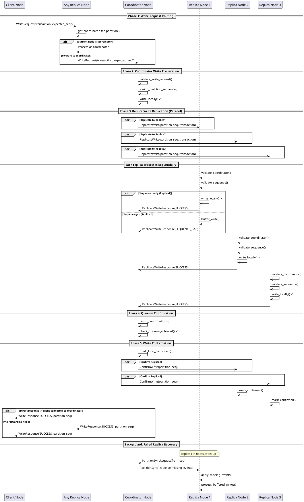

## Overview

This specification defines the distributed write protocol for Eventus, where writes are coordinated by the "oldest running node" that owns a partition. The protocol ensures strong consistency, fault tolerance, and maintains gapless partition sequences required for event sourcing.

## Core Design Principles

1. **Single Coordinator Per Write**: Only one node coordinates each write to prevent conflicts
2. **Deterministic Node Selection**: Coordinator selection is deterministic and consistent across nodes
3. **Write-Then-Replicate**: Coordinator writes locally first, then replicates to ensure atomicity
4. **Sequential Processing**: Replicas process writes in strict partition sequence order
5. **Quorum Confirmation**: Writes only succeed when confirmed by majority of replicas
6. **No Gaps Tolerance**: Any sequence gap invalidates the write and requires recovery

## Node Ordering and Selection

### Coordinator Selection Algorithm

```rust
fn get_coordinator_for_partition(partition_id: PartitionId) -> NodeId {
    let replicas = get_replicas_for_partition(partition_id);
    let healthy_replicas = replicas.filter(|node| node.is_healthy());
    
    // Sort by startup timestamp (ascending), then by peer_id as tiebreaker
    healthy_replicas.sort_by_key(|node| (node.startup_timestamp, node.peer_id));
    
    healthy_replicas.first().unwrap()
}
```

**Key Properties**:

- Oldest running node (by startup timestamp) becomes coordinator
- Deterministic across all nodes in cluster
- Automatically fails over when coordinator becomes unhealthy
- Self-stabilizing - no additional election protocol needed

## Write Protocol Phases

### Phase 1: Write Request Routing

```
Client/Node → Any Replica Node → Coordinator Node
```

**Flow**:

1. Write request arrives at any replica node for the partition
2. Node determines coordinator using `get_coordinator_for_partition()`
3. If current node is coordinator, proceed to Phase 2
4. If not coordinator, forward request to coordinator
5. If coordinator unreachable, try next node in deterministic order

**Message**: `WriteRequest`

```rust
struct WriteRequest {
    transaction: Transaction,
    client_id: NodeId,
    request_id: RequestId,
    expected_partition_seq: Option<u64>,
}
```

### Phase 2: Coordinator Write Preparation

**Coordinator Actions**:

1. Validate write request (schema, permissions, etc.)
2. Check expected partition sequence if provided
3. Assign new partition sequence number atomically
4. Write event transaction to local storage **immediately**
5. Create replication message for other replicas

**Message**: `ReplicateWrite`

```rust
struct ReplicateWrite {
    coordinator_id: NodeId,
    partition_id: PartitionId,
    partition_sequence: u64,
    transaction: Transaction,
    coordinator_startup_timestamp: SystemTime,
}
```

### Phase 3: Replica Write Replication

**Each Replica Actions**:

1. **Coordinator Validation**: Verify sender is expected coordinator
2. **Sequence Validation**: Check partition sequence for correctness
3. **Sequential Buffering**: Buffer out-of-order writes if necessary
4. **Local Write**: Write event to local storage when sequence is correct
5. **Send Confirmation**: Respond with success/failure to coordinator

**Validation Logic**:

```rust
fn validate_replicate_write(&self, msg: &ReplicateWrite) -> Result<(), WriteError> {
    // 1. Replica set validation (relaxed coordinator check)
    let replica_set = self.get_replicas_for_partition(msg.partition_id);
    if !replica_set.contains(&msg.coordinator_id) {
        return Err(WriteError::InvalidSender);
    }
    
    // 2. Startup timestamp validation (prevents stale writes from restarted nodes)
    let sender_info = self.get_node_info(msg.coordinator_id)?;
    if msg.coordinator_startup_timestamp < sender_info.startup_timestamp {
        return Err(WriteError::StaleWrite);
    }
    
    // 3. Sequence validation
    let current_seq = self.get_current_partition_sequence(msg.partition_id);
    if msg.partition_sequence <= current_seq {
        return Err(WriteError::SequenceAlreadyWritten);
    }
    
    if msg.partition_sequence > current_seq + 1 {
        // Gap detected - need to catch up
        return Err(WriteError::SequenceGap);
    }
    
    Ok(())
}
```

### Phase 4: Quorum Confirmation

**Coordinator Actions**:

1. Collect `ReplicateWriteResponse` messages from replicas
2. Count successful confirmations (including own write)
3. If quorum achieved, proceed to Phase 5
4. If quorum not achieved within timeout, abort write
5. Handle any error responses from replicas

**Message**: `ReplicateWriteResponse`

```rust
struct ReplicateWriteResponse {
    replica_id: NodeId,
    partition_id: PartitionId,
    partition_sequence: u64,
    result: Result<(), WriteError>,
    current_partition_seq: u64, // For gap detection
}
```

### Phase 5: Write Confirmation

**Coordinator Actions**:

1. Mark local event as confirmed/committed
2. Send confirmation to all replicas that successfully wrote
3. Send final response to client
4. Handle any failed replicas (initiate recovery if needed)

**Message**: `ConfirmWrite`

```rust
struct ConfirmWrite {
    coordinator_id: NodeId,
    partition_id: PartitionId,
    partition_sequence: u64,
}
```

## Sequential Processing and Buffering

### Write Buffer Management

Each replica maintains a sequential write buffer per partition:

```rust
struct PartitionWriteBuffer {
    partition_id: PartitionId,
    next_expected_seq: AtomicU64,
    buffered_writes: BTreeMap<u64, BufferedWrite>,
    processing_task: Option<JoinHandle<()>>,
}

struct BufferedWrite {
    message: ReplicateWrite,
    received_at: Instant,
    retry_count: u32,
}
```

### Buffer Processing Algorithm

```rust
async fn process_write_buffer(&mut self, partition_id: PartitionId) {
    let buffer = self.get_buffer_mut(partition_id);
    let mut next_seq = buffer.next_expected_seq.load(Ordering::Acquire);
    
    while let Some(buffered_write) = buffer.buffered_writes.remove(&next_seq) {
        match self.apply_write_locally(buffered_write.message).await {
            Ok(_) => {
                // Send confirmation to coordinator
                self.send_write_confirmation(partition_id, next_seq).await;
                next_seq += 1;
                buffer.next_expected_seq.store(next_seq, Ordering::Release);
            }
            Err(err) => {
                // Send error response and re-buffer if retryable
                self.send_write_error(partition_id, next_seq, err).await;
                if buffered_write.retry_count < MAX_RETRIES {
                    buffer.buffered_writes.insert(next_seq, BufferedWrite {
                        retry_count: buffered_write.retry_count + 1,
                        ..buffered_write
                    });
                }
                break;
            }
        }
    }
}
```

## Edge Cases and Error Handling

### Case 1: Coordinator Validation

**Question**: Should replicas validate the coordinator? **Answer**: **YES**, replicas MUST validate coordinator identity.

**Validation Requirements**:

1. **Node ID Match**: Sender must match expected coordinator node ID
2. **Startup Timestamp Match**: Prevents old/crashed coordinator from sending stale writes
3. **Liveness Check**: Coordinator must be in healthy node set

**Why This Matters**:

- Prevents Byzantine behavior from compromised nodes
- Handles network partition scenarios cleanly
- Prevents duplicate leadership during failover transitions

### Case 2: Sequence Gap Handling

**Scenarios**:

1. **Replica Behind**: `msg.partition_sequence > current_seq + 1`
2. **Replica Ahead**: `msg.partition_sequence <= current_seq`
3. **Missing Coordinator**: Coordinator crashed between writes

**Handling Strategy**:

```rust
match self.validate_sequence(msg.partition_sequence) {
    SequenceStatus::Behind => {
        // Initiate catch-up process
        self.request_partition_sync(msg.partition_id, msg.coordinator_id).await;
        // Buffer this write for later processing
        self.buffer_write(msg);
    }
    SequenceStatus::Ahead => {
        // This write was already processed
        self.send_duplicate_response(msg).await;
    }
    SequenceStatus::Ready => {
        // Process immediately
        self.apply_write_locally(msg).await;
    }
}
```

### Case 3: Coordinator Failure During Write

**Scenarios**:

1. Coordinator crashes after writing locally but before replication
2. Coordinator crashes during replication phase
3. Network partition isolates coordinator

**Recovery Protocol**:

1. **New Coordinator Detection**: Next node in order detects failure
2. **State Assessment**: Check local partition sequence vs other replicas
3. **Gap Resolution**: Sync any missing events from replicas
4. **Resume Operations**: Begin accepting new writes

### Case 4: Quorum Loss

**Scenario**: Not enough replicas available to achieve quorum.

**Handling**:

1. **Write Rejection**: Coordinator rejects write immediately
2. **Client Notification**: Return `QuorumUnavailable` error
3. **Background Monitoring**: Monitor for replica recovery
4. **Automatic Recovery**: Resume writes when quorum restored

### Case 5: Partial Replication Failures

**Scenario**: Some replicas succeed, others fail, but quorum achieved.

**Handling**:

1. **Confirm Successful Writes**: Send confirmation to successful replicas
2. **Background Reconciliation**: Retry failed replicas in background
3. **Consistent State**: Maintain write success from client perspective
4. **Recovery Process**: Failed replicas will catch up through sync

## Failure Recovery Mechanisms

### Replica Catch-Up Protocol

When a replica detects it's behind:

```rust
async fn catch_up_partition(&self, partition_id: PartitionId, from_seq: u64) {
    let coordinator = self.get_coordinator_for_partition(partition_id);
    
    // Request missing events
    let request = PartitionSyncRequest {
        partition_id,
        from_sequence: from_seq,
        to_sequence: None, // Get all available
    };
    
    let events = coordinator.sync_partition(request).await?;
    
    // Apply events in order
    for event in events {
        self.apply_write_locally(event).await?;
    }
    
    // Resume normal processing
    self.resume_write_processing(partition_id).await;
}
```

### Coordinator Failover

When coordinator failure is detected:

```rust
async fn handle_coordinator_failure(&self, partition_id: PartitionId) {
    let new_coordinator = self.get_coordinator_for_partition(partition_id);
    
    if new_coordinator.node_id == self.node_id {
        // I am the new coordinator
        
        // 1. Assess current state
        let my_seq = self.get_current_partition_sequence(partition_id);
        let replica_states = self.query_replica_states(partition_id).await;
        
        // 2. Determine highest committed sequence
        let highest_committed = self.find_highest_committed_sequence(replica_states);
        
        // 3. Sync to highest committed state if needed
        if my_seq < highest_committed {
            self.sync_from_replicas(partition_id, my_seq + 1, highest_committed).await;
        }
        
        // 4. Resume write coordination
        self.start_coordinating_partition(partition_id).await;
    }
}
```

## Performance Considerations

### Concurrent Write Optimization

While replica processing must be sequential per partition, the coordinator can optimize by:

1. **Immediate Sequence Assignment**: Coordinator assigns sequences without waiting for previous writes
2. **Parallel Replication**: Send to all replicas simultaneously
3. **Pipelined Coordination**: Start replicating write N+1 while write N is still being confirmed
4. **Batch Confirmations**: Group multiple confirmations in single message (future optimization)

**Example Timeline**:

```
T1: Coordinator assigns seq=100, starts replication
T2: Coordinator assigns seq=101, starts replication (while seq=100 still replicating)  
T3: Replica receives seq=100, processes immediately
T4: Replica receives seq=101, buffers (waiting for seq=100 to complete)
T5: Replica completes seq=100, then processes seq=101 from buffer
```

The key insight: **coordinator can work ahead, replicas process sequentially**.

### Buffer Size Management

```rust
const MAX_BUFFER_SIZE: usize = 1000;
const BUFFER_TIMEOUT_MS: u64 = 5000;

// Evict old buffered writes to prevent memory issues
fn evict_expired_writes(&mut self, partition_id: PartitionId) {
    let buffer = self.get_buffer_mut(partition_id);
    let now = Instant::now();
    
    buffer.buffered_writes.retain(|_, write| {
        now.duration_since(write.received_at).as_millis() < BUFFER_TIMEOUT_MS as u128
    });
    
    if buffer.buffered_writes.len() > MAX_BUFFER_SIZE {
        // Keep only the next N writes we expect
        let next_seq = buffer.next_expected_seq.load(Ordering::Acquire);
        buffer.buffered_writes = buffer.buffered_writes
            .range(next_seq..next_seq + MAX_BUFFER_SIZE as u64)
            .map(|(k, v)| (*k, v.clone()))
            .collect();
    }
}
```

## Consistency Guarantees

This protocol provides:

1. **Strong Consistency**: All replicas see writes in same order
2. **Gapless Sequences**: No missing sequence numbers within partitions
3. **Atomicity**: Writes either succeed on quorum or fail completely
4. **Durability**: Writes persisted before confirmation
5. **Partition Tolerance**: System continues with available replicas

## Implementation Checklist

- [ ] Coordinator selection algorithm
- [ ] Write routing and forwarding logic
- [ ] Sequential write buffer per partition
- [ ] Coordinator validation in replicas
- [ ] Sequence gap detection and handling
- [ ] Quorum tracking and timeout handling
- [ ] Write confirmation protocol
- [ ] Background catch-up mechanism
- [ ] Coordinator failover detection
- [ ] Buffer overflow and timeout handling
- [ ] Metrics and monitoring integration
- [ ] Integration with existing consensus system

This specification provides a robust foundation for implementing distributed writes in Eventus while maintaining the strong consistency guarantees required for event sourcing.

## UML Diagram


